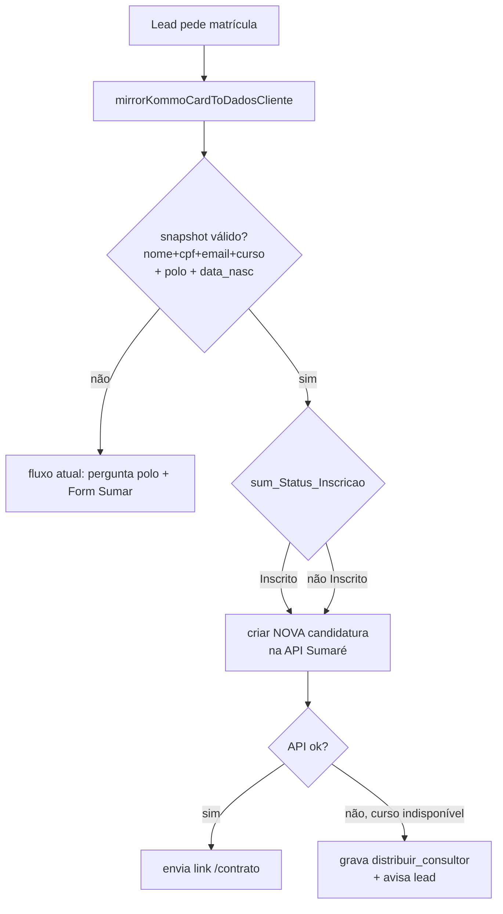

# Plano — Inscrição usando dados do card Kommo (Sumaré Comercial)

> **Status:** EXECUTADO em 2026-05-28.
> **Decisões finais:** `ux_confirma=express`, `ux_inscrito=criar_novo`,
> `polo=confirma_polo`, `campos_extras=sim_obrigatorios`, `migration=ambos`.
> **Pré-requisito manual:** colar `scripts/sql/00_bootstrap_exec_sql.sql`
> uma vez no Supabase Studio antes de rodar
> `node scripts/apply-sql-rest.mjs scripts/sql/dados_cliente_sum_kommo_mirror.sql`.
> Sem a migration o código continua funcionando (cai no fluxo Form Sumar
> tradicional), mas o express não ativa.

---

## Contexto

Hoje o agente sempre dispara o **Formulario_Sum** (formulário do WhatsApp) para coletar dados do candidato, mesmo quando o card no Kommo já tem todos os campos `sum_*` preenchidos pelos canais comerciais (Sumaré Comercial / API Sumaré).

Caso real lead **CAIO SILVA (#23608285)**: card já tinha `sum_Nome`, `sum_CPF`, `sum_Email`, `sum_Data_Nascimento`, `sum_Curso=Pedagogia`, `sum_Polo=Barra Funda`, `sum_Status_Inscricao=Inscrito`, `sum_Data_Inscricao=16/05/2026`. Mesmo assim, o agente perguntou polo, mandou o Form Sumar e, ao tentar criar candidatura na API Sumaré, entrou em **loop infinito** do scheduler pós-formulário porque o pipeline não conseguiu avançar (curso "Pedagogia" indisponível para inscrição automática) e o `inscricao_form_status` não foi gravado em estado terminal.

Objetivo: **reaproveitar o card Kommo** como fonte de dados de inscrição, espelhar no `dados_cliente_sum` e pular o Formulario_Sum quando o card já tem o necessário.

---

## Decisões aprovadas

### ux_confirma → **EXPRESS**
Quando o card tem todos os dados, **criar candidatura direto** sem mostrar "Você é X, CPF Y... confirma?" ao candidato. Fluxo mais rápido; o trade-off de dado errado fica com o canal que populou o card.

### ux_inscrito → **CRIAR NOVA candidatura**
Quando `sum_Status_Inscricao = "Inscrito"` (candidato já estava inscrito antes mas não respondeu/perdeu prazo), **criar nova candidatura** na API Sumaré mesmo assim (pode haver duplicação na API — aceitável conforme aprovação).

---

## Decisões pendentes (bloqueiam execução)

### 1. Polo já preenchido no card (`sum_Polo`)

| Opção | Comportamento |
|---|---|
| `sim_pular` | Reaproveita `sum_Polo` direto, não pergunta polo ao lead |
| `confirma_polo` | "Você quer manter Barra Funda como polo?" antes de seguir |
| `sempre_pergunta` | Ignora `sum_Polo` do card |

### 2. Campos obrigatórios na API Sumaré

| Opção | Comportamento |
|---|---|
| `sim_obrigatorios` | Se `sum_Data_Nascimento` OU `sum_Modalidade` faltar no card, não tenta express — manda Form Sumar |
| `so_data_nasc` | `sum_Data_Nascimento` obrigatório; `sum_Modalidade` tem default `EAD` |
| `nao_sei` | Tenta criar candidatura e deixa a API responder; ajusta os obrigatórios depois conforme erro |

### 3. Como aplicar a migration SQL

| Opção | Comportamento |
|---|---|
| `agora_supabase` | Aplica via REST direto, agora |
| `gera_sql` | Cria `scripts/sql/dados_cliente_sum_kommo_mirror.sql`, eu rodo manualmente no painel |
| `ambos` | Gera o arquivo .sql E aplica via REST (com log de cada coluna) |

---

## Escopo técnico

### Banco — colunas a adicionar em `dados_cliente_sum`

Atualmente ausentes (e algumas já são referenciadas pelo código → silent fail):

```sql
ALTER TABLE dados_cliente_sum
  ADD COLUMN IF NOT EXISTS polo_inscricao_escolhido text,     -- já usada no código, não existia
  ADD COLUMN IF NOT EXISTS captacao_unidade text,             -- já usada no código, não existia
  ADD COLUMN IF NOT EXISTS kommo_nome text,
  ADD COLUMN IF NOT EXISTS kommo_cpf text,
  ADD COLUMN IF NOT EXISTS kommo_email text,
  ADD COLUMN IF NOT EXISTS kommo_data_nasc text,
  ADD COLUMN IF NOT EXISTS kommo_curso text,
  ADD COLUMN IF NOT EXISTS kommo_polo text,
  ADD COLUMN IF NOT EXISTS kommo_status_inscricao text,
  ADD COLUMN IF NOT EXISTS kommo_sync_at timestamptz;
```

### Código — módulos novos / alterados

| Arquivo | Tipo | Função |
|---|---|---|
| `server/kommoCardMirror.js` | **novo** | `mirrorKommoCardToDadosCliente(env, { telefone, leadId })` — TTL 5min para evitar regrava em cada turno. |
| `server/inscricaoKommoPreFilledFlow.js` | **novo** | `tryHandleInscricaoFromKommoCard(env, input)` — se snapshot válido + polo presente + lead pediu matrícula → executa `executeCaptacaoAfterFormResolved` direto. |
| `server/ai/agentRunner.js` | alterar | Plugar o pre-filled flow **antes** de `tryHandlePoloPreFormFlow` e `tryHandleInscricaoFormStart`. |
| `server/inscricaoPostFormPipeline.js` | alterar | Quando captação falha por curso indisponível → gravar `inscricao_form_status = distribuir_consultor` (terminal) para parar o loop scheduler. |
| `server/dadosClienteInscricaoFields.js` | alterar | Adicionar novas colunas ao `DADOS_CLIENTE_INSCRICAO_SELECT`. |
| `scripts/sql/dados_cliente_sum_kommo_mirror.sql` | **novo** | DDL ALTER TABLE acima. |
| `scripts/test-inscricao-flow.mjs` | alterar | Seção 10: snapshot válido vai pra express, snapshot incompleto cai no Form Sumar. |

### Estado novo

Adicionar a `libShared/inscricaoFormHeuristics.js`:

```js
export const INSCRICAO_FORM_STATUS_DISTRIBUIR_CONSULTOR = 'distribuir_consultor'
```

Adicionar ao conjunto `MATRICULA_POS_FORM_TERMINAL_STATUSES` para parar o loop pós-form.

---

## Fluxo após implementação



---

## Trade-offs e mitigações

| Risco | Mitigação |
|---|---|
| Dado errado no Kommo cria candidatura errada | Aprovado conforme `ux_confirma=express`; logs detalhados de cada criação para auditoria |
| Duplicação na API quando já está Inscrito | Aprovado conforme `ux_inscrito=criar_novo`; API Sumaré que decide o que fazer |
| Polo divergente entre card e preferência atual do lead | Depende da decisão 1 acima |
| Loop scheduler em caso de falha de captação | Estado terminal `distribuir_consultor` |
| Migration aplicada em prod sem backup | Decisão 3 — qual caminho |

---

## Validação antes do deploy

1. `npm run test:inscricao-flow` (seção 10 nova)
2. `npm run test:outbound-dedupe-race` (regressão)
3. Smoke manual: lead com card completo → deve não receber Form Sumar
4. Smoke manual: lead com card incompleto → deve receber Form Sumar (fluxo atual)
5. Smoke manual: reset CAIO SILVA (#23608285) e validar que loop não volta

---

## Deploy

Igual aos últimos: `.\scripts\easypanel-deploy-agente-sumare.ps1 -Target prod`. Reset do lead 23608285 após confirmação.
