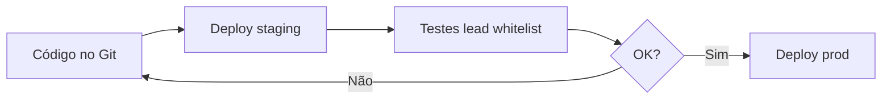

# Ambiente de testes (staging) vs produção

Objetivo: validar alterações no código **sem impactar** leads reais em produção. Só depois de aprovado no staging, o mesmo commit vai para `agente_sumare` (prod).

## Visão geral

| Item | Staging (testes) | Produção |
|------|------------------|----------|
| Serviço EasyPanel | `banco/agente_sumare_staging` | `banco/agente_sumare` |
| URL pública | Definir no EasyPanel (ex. subdomínio `*-staging`) | `banco-agente-sumare.*.easypanel.host` |
| Git | Mesmo repositório `Agente_sumar-_ia` | Mesmo repositório |
| Leads atendidos | Só `KOMMO_AGENT_TEST_LEAD_IDS` | Todos no funil (ou whitelist se configurada) |
| Orphan flush | **Desligado** (`false`) | **Desligado** (recomendado) |
| Job feedback comercial | Desligado no deploy script | Conforme necessidade |

## 1. Criar o serviço no EasyPanel (uma vez)

1. No projeto **banco**, duplique ou crie um app novo: **`agente_sumare_staging`**.
2. Mesma configuração de build do prod:
   - Install: `npm install`
   - Build: `npm run build`
   - Start: `npm start`
   - Porta: `8000`
3. Conecte ao **mesmo repositório Git** e branch `main` (ou branch `staging` se preferir).
4. Copie as variáveis de ambiente do `agente_sumare`, depois ajuste (seção 2).
5. Domínio público: use outro host (ex. `banco-agente-sumare-staging....easypanel.host`).
6. Webhook Evolution: aponte para  
   `https://SEU-HOST-STAGING/api/evolution/webhook`  
   **ou** use `EVOLUTION_INGEST_PHONE_ALLOWLIST` só com telefones de teste na instância compartilhada.

## 2. Variáveis críticas no staging

O script de deploy aplica estes overrides ao serviço staging:

```env
APP_ENV=staging
KOMMO_AGENT_TEST_LEAD_IDS=23841399
KOMMO_SCHEDULER_WEBHOOK_ORPHAN_FLUSH=false
FEEDBACK_JOB_ENABLED=false
KOMMO_SCHEDULER_VERBOSE=true
```

Opcional — limitar quem entra no buffer pelo webhook:

```env
EVOLUTION_INGEST_PHONE_ALLOWLIST=5511944690752
```

Defina no PowerShell antes do deploy:

```powershell
$env:STAGING_PHONE_ALLOWLIST = '5511944690752'
```

Tokens (`OPENAI_API_KEY`, `KOMMO_ACCESS_TOKEN`, `SUPABASE_*`, `WHATSAPP_*`) ficam no painel EasyPanel do serviço staging (copiar do prod e revisar).

## 3. Fluxo de trabalho diário



### Deploy staging (testes)

```powershell
$env:EP_EMAIL = '...'
$env:EP_PASSWORD = '...'
$env:SUMARE_CAPTACAO_TOKEN = '...'   # se testar captação

.\scripts\easypanel-deploy-agente-sumare.ps1 -Target staging
```

Verificar:

```powershell
Invoke-RestMethod 'https://SEU-HOST-STAGING/api/health'
# Deve retornar app_env: staging (após primeiro deploy com APP_ENV)
```

### Promover para produção

Somente quando staging estiver validado:

```powershell
.\scripts\easypanel-deploy-agente-sumare.ps1 -Target prod
```

Isso atualiza env seguro em `agente_sumare` e dispara `deployService` no commit atual do Git.

### Só atualizar env (sem rebuild)

```powershell
.\scripts\easypanel-deploy-agente-sumare.ps1 -Target staging -SkipDeploy
```

## 4. Testes recomendados no staging

1. Lead de teste no funil Agente-Sumaré (`KOMMO_AGENT_TEST_LEAD_IDS`).
2. Mensagem WhatsApp → agente responde só nesse lead.
3. Lead **fora** da whitelist / fora do status → **não** deve responder (com `ORPHAN_FLUSH=false`).
4. Form Sumar + polo + captação (se habilitado).
5. `node --env-file=.env scripts/investigate-lead.mjs <leadId>` contra API Kommo.

## 5. O que não compartilhar entre ambientes

- **Não** remover `KOMMO_AGENT_TEST_LEAD_IDS` no staging sem revisão.
- **Não** ligar `KOMMO_SCHEDULER_WEBHOOK_ORPHAN_FLUSH=true` no staging se o objetivo é simular produção fiel.
- Cuidado com **captação real** (`SUMARE_CAPTACAO_ENABLED`): em staging use `SUMARE_CAPTACAO_TEST_ALLOW=true` e leads fictícios.

## 6. Branch Git (opcional)

- `main` → staging deploy frequente.
- Tag ou deploy manual em prod após QA.

Alternativa: branch `staging` no Git com o serviço EasyPanel apontando só para ela; merge em `main` antes do deploy prod.
